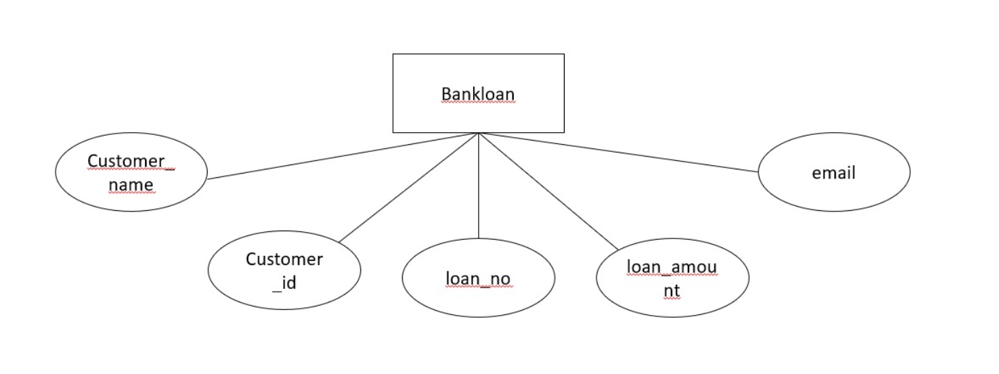
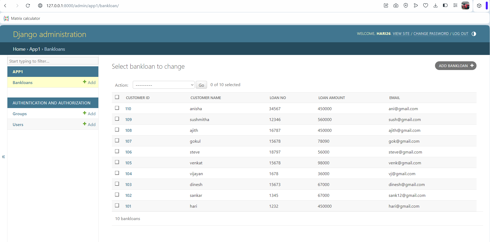

# Ex02 Django ORM Web Application
## Date: 16.11.24

## AIM
To develop a Django application to store and retrieve data from a bank loan database using Object Relational Mapping(ORM).

## ENTITY RELATIONSHIP DIAGRAM



## DESIGN STEPS

### STEP 1:
Clone the problem from GitHub

### STEP 2:
Create a new app in Django project

### STEP 3:
Enter the code for admin.py and models.py

### STEP 4:
Execute Django admin and create details for 10 books

## PROGRAM
```
admin.py
from django.contrib import admin
from .models import bankloan,user
admin.site.register(bankloan,user)

models.py
from django.db import models
from django.contrib import admin
class bankloan (models.Model):
    customer_id=models.CharField(max_length=100,primary_key=True)
    Customer_name=models.CharField(max_length=100)
    loan_no=models.IntegerField()
    loan_amount=models.IntegerField()
    email=models.EmailField()
 
class user(admin.ModelAdmin):
    list_display=('customer_id','Customer_name','loan_no','loan_amount','email')
```


## OUTPUT




## RESULT
Thus the program for creating a database using ORM hass been executed successfully
